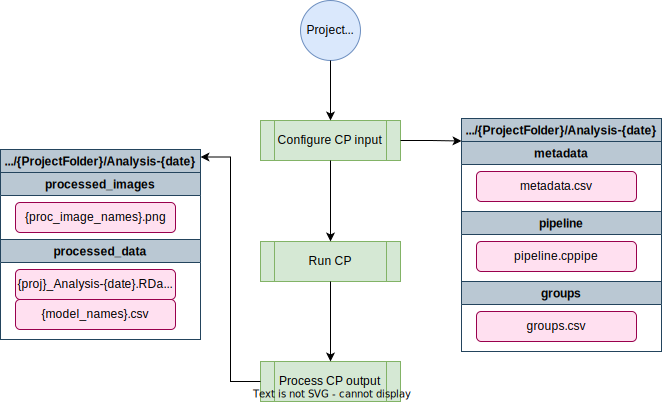

# cellprofiler-nf
*A nextflow pipeline to run CellProfiler pipelines on raw images and process output*

## Pipeline overview


## Rockfish usage
```bash
# clone the repo
git clone https://github.com/AndersenLab/cellprofiler-nf.git
cd cellprofiler-nf

# setup environment
module load anaconda/2022.05
module load singularity
source activate /data/eande106/software/conda_envs/nf23_env/

# example run with dauer pipeline parameter
nextflow run main.nf --pipeline dauer --project <output project dir> --debug -profile rockfish

# example run with toxin pipeline parameter
nextflow run main.nf --pipeline toxin --project <output project dir> --debug -profile rockfish
```

Using debug will copy the raw images to your specified project folder prior to analysis. The `-profile` option isn't actually needed here since the default is the rockfish profile.

## QUEST usage
```bash
# clone the repo
git clone https://github.com/AndersenLab/cellprofiler-nf.git
cd cellprofiler-nf

# setup environment
module load python/anaconda3.6
module load singularity
source activate /projects/b1059/software/conda_envs/nf23_env/

# example run with dauer pipeline parameter
nextflow run main.nf --pipeline dauer --project <output project dir> --debug -profile quest

# example run with toxin pipeline parameter
nextflow run main.nf --pipeline toxin --project <output project dir> --debug -profile quest
```

Using debug will copy the raw images to your specified project folder prior to analysis.

## cellprofiler-nf help
```
C E L L P R O F I L E R - N F   P I P E L I N E
===============================================
Usage:
The typical command for running the pipeline is as follows:
nextflow run main.nf --pipeline <CellProfiler pipeline to use> --project <path to your project directory>

Mandatory arguments:
--project                      The path to your project directory
--pipeline                     The CP pipeline to use: toxin, dauer

Optional arguments:
--groups                       comma separated metadata groupings for CellProfiler, default is plate,well
--outdir                       Output directory to place files, default is project/Analysis-{current date}
--help                         This usage statement.
```

## Input directory structure
`cellprofiler-nf` requires that the input project directory contains a `raw_images` subdirectory that holds all the images to be processed by CellProfiler. See the examples below for dauer and toxin projects. The AndersenLab/easyXpress R package can be used to help organize image files exported from the imager into the required directory structure. See `easyXpress::tidyProject` for details. 
### dauer input
```bash
20220501_dauerDebug/
├── raw_images
    └── 20220501_dauerDebug-p002-m2X_A01_w1.TIF
    └── 20220501_dauerDebug-p002-m2X_A01_w2.TIF
    └── ...
``` 
### toxin input
```bash
20220501_toxinDebug/
├── raw_images
    └── 20220501_toxinDebug-p001-m2X_A01.TIF
    └── 20220501_toxinDebug-p010-m2X_A01.TIF
    └── 20220501_toxinDebug-p169-m2X_D11.TIF
    └── ...
``` 
The files in the `raw_image` subdirectory must conform to the folloing naming conventions:\
|   **dauer -** Date-Experiment Name-Plate-Magnification_Well_Wavelength.TIF\
|   **toxin -** Date-Experiment Name-Plate-Magnification_Well.TIF

It is possible that there will be thumbnails included. These will automatically be ignored. It is also possible that a 36-character hash will be added to the end of each file name, prior to the file extension. This will be stripped by the pipeline and will not cause issues.

## Output directory structure
By default `cellprofiler-nf` will output results to a subdirectory in the project folder named `Analysis-{current date}` with the following directory structures.

### dauer output
```bash
<project folder name>/
├── raw_images
├── Analysis-{current date}
    └── pipeline
    └── metadata
    └── groups
    └── processed_data
        └── 20220501_dauerDebug_Analysis-{current date}.RData
    └── processed_images
        └── 20220501_dauerDebug-p002-m2X_A01_w1_overlay.png
        └── 20220501_dauerDebug-p002-m2X_A01_w1_dauerMod_straightened_RFP.png
        └── 20220501_dauerDebug-p002-m2X_A01_w1_nondauerMod_straightened_RFP.png
        └── 20220501_dauerDebug-p002-m2X_A01_w2_dauerMod_NonOverlappingWorms_RFP_mask.png
        └── 20220501_dauerDebug-p002-m2X_A01_w2_nondauerMod_NonOverlappingWorms_RFP_mask.png
        └── ...
```

### toxin output
```bash
<project folder name>/
├── raw_images
├── Analysis-{current date}
    └── pipeline
    └── metadata
    └── groups
    └── processed_data
        └── 20220501_toxinDebug_Analysis-{current date}.RData
    └── processed_images
        └── 20220501_dauerDebug-p002-m2X_A01_w1_overlay.png
        └── ...
```
